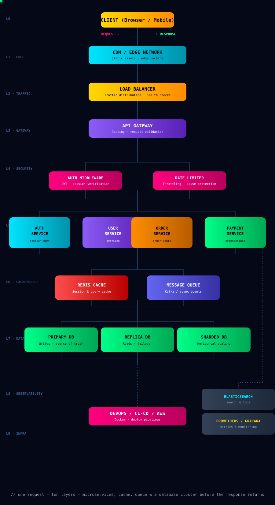

<!-- ========================================================= -->
<!--         NIKHIL KUMAR CHAUHAN | DEVELOPER OS v2.0            -->
<!-- ========================================================= -->

<div align="center">


<br>


<br>


<br><br>

&nbsp;&nbsp;&nbsp;&nbsp;&nbsp;&nbsp;&nbsp;&nbsp;&nbsp;&nbsp;&nbsp;&nbsp;&nbsp;&nbsp;&nbsp;&nbsp;&nbsp;&nbsp;&nbsp;&nbsp;&nbsp;&nbsp;&nbsp;&nbsp;&nbsp;&nbsp;&nbsp;&nbsp;&nbsp;&nbsp;&nbsp;&nbsp;&nbsp;&nbsp;&nbsp;&nbsp;&nbsp;&nbsp;&nbsp;

<br><br>

> 🛰️ **Building scalable, responsive, and production-ready web applications with modern frontend and backend technologies.**

<br>

<a href="https://github.com/nikhilchauhan018">

</a>
<a href="https://www.linkedin.com/in/nikhil-kumar-chauhan-795964331/">

</a>
<a href="mailto:nikhilkumarchauhan165@gmail.com">

</a>
<a href="https://nikhilweb018.netlify.app/">

</a>

<br><br>


</div>

---

<div align="center">

#  ABOUT ME

</div>

> I'm **Nikhil Kumar Chauhan**, a **Full-Stack Software Engineer** focused on building modern, scalable, and maintainable web applications. I have hands-on experience developing complete products across the frontend and backend using **React.js, Next.js, TypeScript, Node.js, Express.js, REST APIs, and SQL/NoSQL databases**. I've built and worked on real-world applications including **GYLO Fresh** (a grocery e-commerce platform), a **Doctor Appointment Platform**, and a **Donation & Charity System**, along with research and software projects involving data processing and computer vision. I'm also a **Co-Founder of GreenSort** and have contributed to a **published patent project**. Currently, I'm strengthening my expertise in **system design, software architecture, Docker, AWS, cloud deployment, and backend engineering**, while actively looking for opportunities to contribute to impactful software products.

---

<table>
<tr>

<td width="48%" valign="top">

###  TERMINAL

```text
nikhil@github:~$ whoami

Name      : Nikhil Kumar Chauhan
Role      : Full-Stack Software Engineer

Frontend  : React.js / Next.js
Backend   : Node.js / Express / Django
Languages : JavaScript / TypeScript
            Python / Java / SQL

Databases : MySQL / PostgreSQL / MongoDB

Focus     : Scalable Web Applications

nikhil@github:~$ _
```

</td>

<td width="52%" valign="top">

###  DEVELOPER MODE


</td>

</tr>
</table>

---

<div align="center">

##  SYSTEM STATUS

</div>

<table>
<tr>
<td width="50%" valign="top">

```text
┌──────────────────────────────────────────┐
│              DEVELOPER OS                │
├──────────────────────────────────────────┤
│                                          │
│  FRONTEND       🟩🟩🟩🟩🟩🟩🟩🟩🟩🟩  100%  │
│  BACKEND        🟦🟦🟦🟦🟦🟦🟦🟦🟦░  95%   │
│  DATABASE       🟪🟪🟪🟪🟪🟪🟪🟪░░  85%   │
│  API DESIGN     🟧🟧🟧🟧🟧🟧🟧🟧🟧░  92%   │
│  GIT WORKFLOW   🟥🟥🟥🟥🟥🟥🟥🟥🟥🟥  100% │
│  DEVOPS         🟨🟨🟨🟨🟨░░░░░░  50%   │
│                                          │
│  🟢 BUILDING       ACTIVE                │
│  🟢 LEARNING       ACTIVE                │
│  🟢 OPEN SOURCE    ACTIVE                │
│                                          │
└──────────────────────────────────────────┘
```

</td>

<td width="50%" valign="top">

```text
nikhil@github:~$ cat mission.txt

🎯 01  Build real products
🎯 02  Write maintainable code
🎯 03  Improve system design
🎯 04  Learn modern engineering
🎯 05  Contribute to open source
🎯 06  Keep shipping

nikhil@github:~$ echo $NEXT

🚀 Become a stronger software engineer.
```

</td>
</tr>
</table>

---

<div align="center">

#  ENGINEERING STACK

###  Frontend

&nbsp;&nbsp;&nbsp;&nbsp;&nbsp;&nbsp;&nbsp;&nbsp;&nbsp;&nbsp;&nbsp;&nbsp;&nbsp;&nbsp;&nbsp;&nbsp;&nbsp;&nbsp;&nbsp;&nbsp;&nbsp;&nbsp;&nbsp;&nbsp;&nbsp;&nbsp;&nbsp;

###  Backend

&nbsp;&nbsp;&nbsp;&nbsp;&nbsp;&nbsp;&nbsp;&nbsp;&nbsp;&nbsp;&nbsp;&nbsp;&nbsp;&nbsp;&nbsp;&nbsp;&nbsp;&nbsp;&nbsp;&nbsp;&nbsp;

###  Tools & DevOps

&nbsp;&nbsp;&nbsp;&nbsp;&nbsp;&nbsp;&nbsp;&nbsp;&nbsp;&nbsp;&nbsp;&nbsp;&nbsp;&nbsp;&nbsp;&nbsp;&nbsp;&nbsp;&nbsp;&nbsp;&nbsp;&nbsp;&nbsp;&nbsp;&nbsp;&nbsp;&nbsp;


</div>

---

<div align="center">

#  TECH UNIVERSE



</div>

---

<table>
<tr>

<td width="33%" valign="top">

###  STRONG

&nbsp;&nbsp;&nbsp;&nbsp;&nbsp;&nbsp;&nbsp;&nbsp;&nbsp;&nbsp;&nbsp;&nbsp;&nbsp;&nbsp;&nbsp;

   

  

</td>

<td width="34%" valign="top">

###  WORKING KNOWLEDGE

&nbsp;&nbsp;&nbsp;&nbsp;&nbsp;&nbsp;&nbsp;&nbsp;&nbsp;&nbsp;&nbsp;&nbsp;

   

  

</td>

<td width="33%" valign="top">

###  LEARNING

&nbsp;&nbsp;&nbsp;&nbsp;&nbsp;&nbsp;

    

  

</td>

</tr>
</table>

---

<div align="center">

#  FEATURED PROJECTS

</div>

<table>
<tr>

<td width="50%" valign="top">


<br><br>

<a href="YOUR_GYLO_REPO">

</a>
<a href="https://gylo.in/">

</a>

</td>

<td width="50%" valign="top">


<br><br>

<a href="YOUR_DOCTOR_REPO">

</a>
<a href="https://doctor-appointment-cu8t.vercel.app/">

</a>

</td>

</tr>

<tr>

<td width="50%" valign="top">


<br><br>

<a href="https://donattion-charity.netlify.app/">

</a>

</td>

<td width="50%" valign="top">


<br><br>

<a href="https://greensort.in/">

</a>

</td>

</tr>

<tr>

<td width="50%" valign="top">

###  Relaxi
**Patented Smart Alarm Project**

A smart alarm project focused on intelligent wake-up experiences and adaptive alarm behavior.

- 🧠 Smart alarm concept
- 🤖 Intelligent behavior
- 💡 Product innovation
- ✨ User experience
- 📜 Patented project

</td>

<td width="50%" valign="top">

###  RGB-D Facial Micro-Motion
**Major / Research Project**

A research-oriented system using RGB-D data and temporal facial micro-motion analysis.

- 📷 RGB-D data
- 😐 Facial analysis
- ⏱️ Temporal information
- 🔬 Micro-motion detection
- 🧪 Research-oriented system


</td>

</tr>
</table>

---

<div align="center">

##  SOFTWARE ENGINEERING

</div>

<table>
<tr>

<td width="33%" valign="top">

###  CORE

     

</td>

<td width="33%" valign="top">

###  API & SECURITY

        

</td>

<td width="33%" valign="top">

###  ENGINEERING

       

</td>

</tr>
</table>

---

<div align="center">

#  SYSTEM ARCHITECTURE



</div>

---

<div align="center">

#  GITHUB ANALYTICS





<br><br>


<br><br>


</div>

---

<div align="center">

#  CONTRIBUTION MATRIX

<picture>
  <source media="(prefers-color-scheme: dark)" srcset="https://raw.githubusercontent.com/nikhilchauhan018/nikhilchauhan018/output/github-contribution-grid-snake-dark.svg"/>
  <source media="(prefers-color-scheme: light)" srcset="https://raw.githubusercontent.com/nikhilchauhan018/nikhilchauhan018/output/github-contribution-grid-snake.svg"/>
  
</picture>

</div>

---

<table>
<tr>

<td width="25%" align="center">


###  BUILDING

Next.js
Production Apps
Scalable Frontend

</td>

<td width="25%" align="center">


###  LEARNING

TypeScript
Advanced React
Backend Architecture

</td>

<td width="25%" align="center">


###  EXPLORING

Docker
CI/CD
Cloud Deployment

</td>

<td width="25%" align="center">


###  IMPROVING

AWS
System Design
Testing

</td>

</tr>
</table>

---

<div align="center">

#  DEVELOPER TERMINAL

```text
nikhil@github:~$ ./developer.sh

Booting Developer OS...

[████████████████████████████████] 100%

Frontend Engine       [ ✅ ONLINE ]
Backend Engine        [ ✅ ONLINE ]
Database Layer        [ ✅ ONLINE ]
API Layer             [ ✅ ONLINE ]
Git Workflow          [ ✅ ONLINE ]
Problem Solving       [ ✅ ONLINE ]

--------------------------------------------

CURRENT MISSION

🚀 Build scalable applications.
📖 Learn modern engineering.
🧩 Solve meaningful problems.
📈 Keep improving.

--------------------------------------------

nikhil@github:~$ echo "CODE. LEARN. BUILD. REPEAT."

CODE. LEARN. BUILD. REPEAT.

nikhil@github:~$ _
```

<br>


</div>

---

<div align="center">

#  OPEN SOURCE

```text
┌───────────────────────────────────────────────────────────┐
│                                                           │
│              🌟 OPEN SOURCE ACTIVITY 🌟                   │
│                                                           │
│     CONTRIBUTIONS   •   PULL REQUESTS   •   REVIEWS       │
│                                                           │
│     BUG FIXES       •   FEATURES         •   COLLABORATION│
│                                                           │
└───────────────────────────────────────────────────────────┘
```

</div>

---

<div align="center">

##  ENGINEERING PHILOSOPHY


<br><br>


###  CODE • LEARN • BUILD • REPEAT 

<br>


</div>
