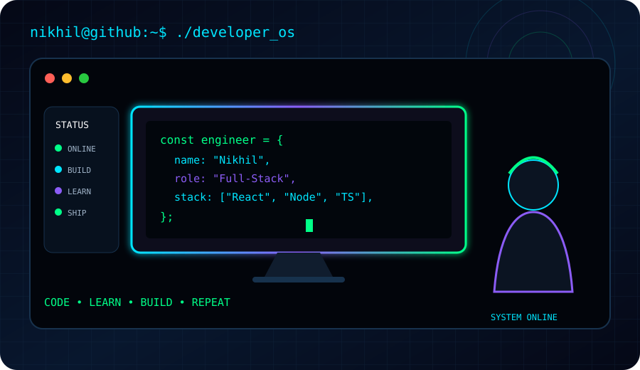

<!-- ========================================================= -->
<!--              NIKHIL KUMAR CHAUHAN | DEVELOPER OS           -->
<!-- ========================================================= -->

<div align="center">


<br>


<br>


<br><br>


<br><br>

> **Building scalable, responsive, and production-ready web applications with modern frontend and backend technologies.**

<br>

<a href="https://github.com/YOUR_USERNAME">

</a>
<a href="https://www.linkedin.com/in/YOUR_LINKEDIN">

</a>
<a href="mailto:YOUR_EMAIL">

</a>
<a href="YOUR_PORTFOLIO_URL">

</a>

<br><br>


</div>

---

<table>
<tr>

<td width="48%" valign="top">

## TERMINAL

```text
nikhil@github:~$ whoami

Name      : Nikhil Kumar Chauhan
Role      : Full-Stack Software Engineer

Frontend  : React.js / Next.js
Backend   : Node.js / Express / Django
Languages : JavaScript / TypeScript
            Python / Java / SQL

Databases : MySQL / PostgreSQL / MongoDB

Focus     : Scalable Web Applications

nikhil@github:~$ _
```

</td>

<td width="52%" valign="top">

## DEVELOPER MODE



</td>

</tr>
</table>

---

<table>
<tr>

<td width="50%" valign="top">

## SYSTEM STATUS

```text
┌─────────────────────────────────────────┐
│             DEVELOPER OS                │
├─────────────────────────────────────────┤
│                                         │
│  FRONTEND       ████████████████  ON    │
│  BACKEND        ███████████████░  ON    │
│  DATABASE       ██████████████░░  ON    │
│  API            ███████████████░  ON    │
│  GIT WORKFLOW   ████████████████  ON    │
│  DEVOPS         ████████░░░░░░░  BUILD  │
│                                         │
│  BUILDING       ACTIVE                  │
│  LEARNING       ACTIVE                  │
│  OPEN SOURCE    ACTIVE                  │
│                                         │
└─────────────────────────────────────────┘
```

</td>

<td width="50%" valign="top">

## CURRENT MISSION

```text
nikhil@github:~$ cat mission.txt

01  Build real products
02  Write maintainable code
03  Improve system design
04  Learn modern engineering
05  Contribute to open source
06  Keep shipping

nikhil@github:~$ echo $NEXT

Become a stronger software engineer.
```

</td>

</tr>
</table>

---

<div align="center">

# ENGINEERING STACK


</div>

---

<table>
<tr>

<td width="33%" valign="top">

## STRONG


**React.js**  
**JavaScript**  
**HTML5 / CSS3**  
**Git / GitHub**

Responsive Design  
REST API Integration  
Modern Frontend Development

</td>

<td width="34%" valign="top">

## WORKING KNOWLEDGE


**Next.js**  
**TypeScript**  
**Node.js / Express**  
**SQL**

API Design  
Authentication / Authorization  
Database Design

</td>

<td width="33%" valign="top">

## LEARNING


**Docker**  
**AWS**  
**CI/CD**  
**Testing**  
**System Design**

Cloud Fundamentals  
Deployment  
Scalable Architecture

</td>

</tr>
</table>

---

## FEATURED PROJECTS

<table>
<tr>

<td width="50%" valign="top">

### GYLO Fresh

**Grocery E-Commerce Platform**

A modern grocery e-commerce platform focused on a smooth customer experience and scalable application architecture.

**Problem → Solution → Product**

- Product discovery
- Shopping cart
- Authentication
- Order management
- Checkout flow
- Responsive interface
- REST API integration


<br><br>

<a href="YOUR_GYLO_REPO">

</a>

<a href="YOUR_GYLO_DEMO">

</a>

</td>

<td width="50%" valign="top">

### Doctor Appointment

**Appointment Booking Platform**

A full-stack platform designed to simplify doctor discovery and appointment scheduling.

**Problem → Solution → Product**

- Doctor profiles
- Appointment booking
- User accounts
- Authentication
- Appointment management
- REST APIs
- Responsive UI


<br><br>

<a href="YOUR_DOCTOR_REPO">

</a>

<a href="YOUR_DOCTOR_DEMO">

</a>

</td>

</tr>

<tr>

<td width="50%" valign="top">

### Donation & Charity Platform

**Full-Stack Donation System**

A platform connecting donors and charitable initiatives through a modern full-stack application.

- Donation workflow
- User authentication
- Organization management
- Donation tracking
- Secure APIs
- Responsive design


<br><br>

<a href="YOUR_DONATION_REPO">

</a>

</td>

<td width="50%" valign="top">

### GreenSort

**Smart Plant-Selection Startup**

A smart plant-selection concept focused on helping users discover suitable plants.

- Smart selection
- Plant discovery
- Modern interface
- Responsive design
- Product experience
- Startup-oriented architecture


<br><br>

<a href="YOUR_GREENSORT_REPO">

</a>

</td>

</tr>

<tr>

<td width="50%" valign="top">

### Relaxi

**Patented Smart Alarm Project**

A smart alarm project focused on intelligent wake-up experiences and adaptive alarm behavior.

- Smart alarm concept
- Intelligent behavior
- Product innovation
- User experience
- Patented project

</td>

<td width="50%" valign="top">

### RGB-D Facial Micro-Motion

**Major / Research Project**

A research-oriented system using RGB-D data and temporal facial micro-motion analysis.

- RGB-D data
- Facial analysis
- Temporal information
- Micro-motion detection
- Research-oriented system


</td>

</tr>
</table>

---

<div align="center">

## SOFTWARE ENGINEERING

</div>

<table>
<tr>

<td width="33%" valign="top">

### CORE

OOP  
Data Structures & Algorithms  
Design Patterns  
SOLID Principles  
Clean Code  
System Design Fundamentals

</td>

<td width="33%" valign="top">

### API & SECURITY

Authentication  
Authorization  
JWT  
Password Hashing  
CORS  
Input Validation  
Middleware  
Error Handling  
API Security

</td>

<td width="33%" valign="top">

### ENGINEERING

SDLC  
Agile / Scrum  
Debugging  
Code Review  
Unit Testing  
Integration Testing  
API Testing  
CI/CD

</td>

</tr>
</table>

---

<div align="center">

# SYSTEM ARCHITECTURE

```text
                         ┌─────────────────┐
                         │      USER       │
                         └────────┬────────┘
                                  │
                                  ▼
                 ┌─────────────────────────────┐
                 │         FRONTEND            │
                 │                             │
                 │ React.js / Next.js          │
                 │ TypeScript / Tailwind       │
                 └─────────────┬───────────────┘
                               │
                               ▼
                 ┌─────────────────────────────┐
                 │          API LAYER          │
                 │                             │
                 │ REST / Auth / Validation    │
                 └─────────────┬───────────────┘
                               │
                               ▼
                 ┌─────────────────────────────┐
                 │          BACKEND            │
                 │                             │
                 │ Node / Express / Django     │
                 └─────────────┬───────────────┘
                               │
                  ┌────────────┼────────────┐
                  ▼            ▼            ▼
              ┌────────┐  ┌──────────┐  ┌──────────┐
              │ MySQL  │  │PostgreSQL│  │ MongoDB  │
              └────────┘  └──────────┘  └──────────┘
                               │
                               ▼
                 ┌─────────────────────────────┐
                 │           DEVOPS            │
                 │ Git / Docker / CI/CD / AWS │
                 └─────────────────────────────┘
```

</div>

---

<div align="center">

# GITHUB ANALYTICS


<br><br>


</div>

---

<div align="center">

# GITHUB ACTIVITY


</div>

---

<div align="center">

# CONTRIBUTION MATRIX


</div>

---

<table>
<tr>

<td width="25%" align="center">


### BUILDING

Next.js  
Production Apps  
Scalable Frontend

</td>

<td width="25%" align="center">


### LEARNING

TypeScript  
Advanced React  
Backend Architecture

</td>

<td width="25%" align="center">


### EXPLORING

Docker  
CI/CD  
Cloud Deployment

</td>

<td width="25%" align="center">


### IMPROVING

AWS  
System Design  
Testing

</td>

</tr>
</table>

---

<div align="center">

# DEVELOPER TERMINAL

```text
nikhil@github:~$ ./developer.sh

Booting Developer OS...

[████████████████████████████████] 100%

Frontend Engine       [ ONLINE ]
Backend Engine        [ ONLINE ]
Database Layer        [ ONLINE ]
API Layer             [ ONLINE ]
Git Workflow          [ ONLINE ]
Problem Solving       [ ONLINE ]

--------------------------------------------

CURRENT MISSION

Build scalable applications.
Learn modern engineering.
Solve meaningful problems.
Keep improving.

--------------------------------------------

nikhil@github:~$ echo "CODE. LEARN. BUILD. REPEAT."

CODE. LEARN. BUILD. REPEAT.

nikhil@github:~$ _
```

<br>


</div>

---

<div align="center">

# OPEN SOURCE

```text
┌─────────────────────────────────────────────────────────────┐
│                                                             │
│              OPEN SOURCE ACTIVITY                           │
│                                                             │
│     CONTRIBUTIONS   •   PULL REQUESTS   •   REVIEWS         │
│                                                             │
│     BUG FIXES       •   FEATURES         •   COLLABORATION  │
│                                                             │
└─────────────────────────────────────────────────────────────┘
```

</div>

---

<div align="center">

## ENGINEERING PHILOSOPHY

**BUILD** &nbsp;&nbsp; **LEARN** &nbsp;&nbsp; **DEBUG** &nbsp;&nbsp; **IMPROVE** &nbsp;&nbsp; **REPEAT**

<br><br>


### CODE • LEARN • BUILD • REPEAT

<br>


</div>
