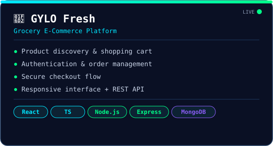
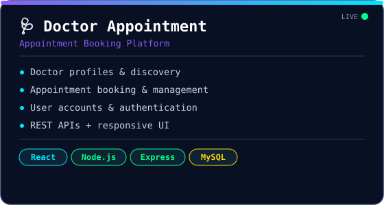
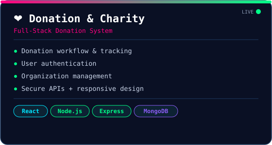
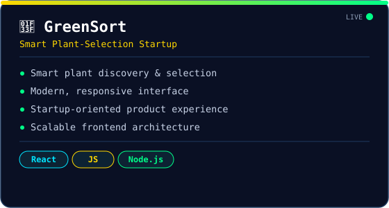
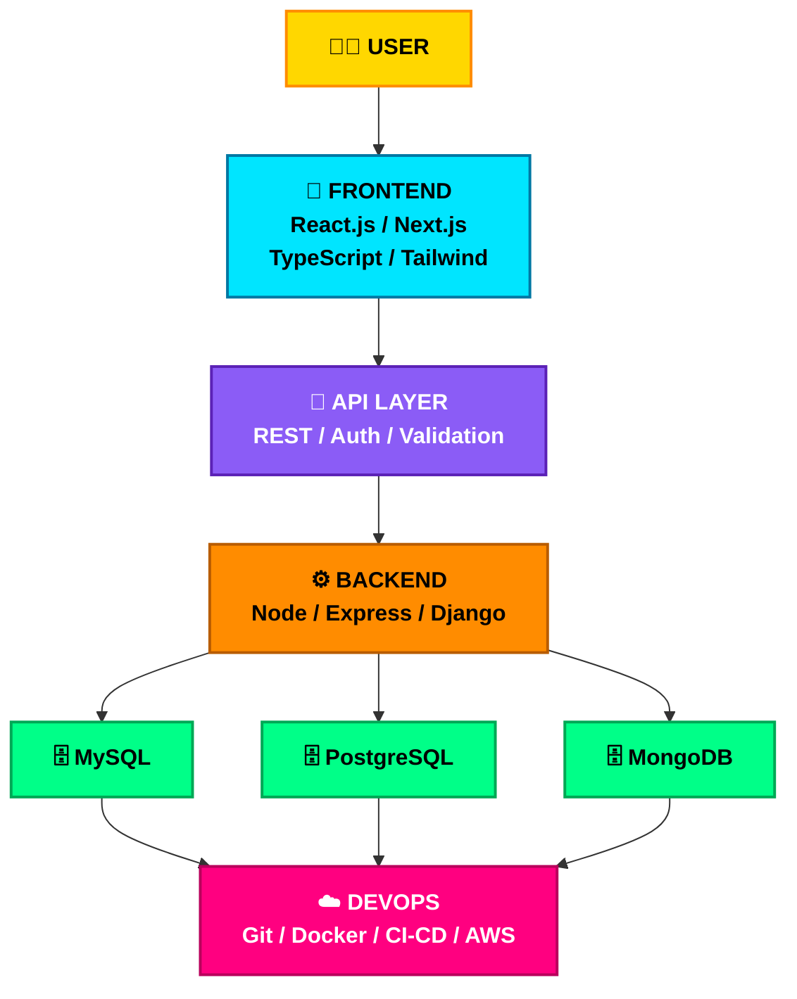

<!-- ========================================================= -->
<!--         NIKHIL KUMAR CHAUHAN | DEVELOPER OS v2.0            -->
<!-- ========================================================= -->

<div align="center">



<br>


<br>


<br><br>


<br><br>

> 🛰️ **Building scalable, responsive, and production-ready web applications with modern frontend and backend technologies.**

<br>

<a href="https://github.com/nikhilchauhan018">

</a>
<a href="https://www.linkedin.com/in/nikhil-kumar-chauhan-795964331/">

</a>
<a href="mailto:nikhilkumarchauhan165@gmail.com">

</a>
<a href="https://nikhilweb018.netlify.app/">

</a>

<br><br>


</div>

---

<table>
<tr>

<td width="48%" valign="top">

### 💻 TERMINAL

```text
nikhil@github:~$ whoami

Name      : Nikhil Kumar Chauhan
Role      : Full-Stack Software Engineer

Frontend  : React.js / Next.js
Backend   : Node.js / Express / Django
Languages : JavaScript / TypeScript
            Python / Java / SQL

Databases : MySQL / PostgreSQL / MongoDB

Focus     : Scalable Web Applications

nikhil@github:~$ _
```

</td>

<td width="52%" valign="top">

### 🌌 DEVELOPER MODE


</td>

</tr>
</table>

---

<div align="center">

## ⚡ SYSTEM STATUS

</div>

<table>
<tr>
<td width="50%" valign="top">

```text
┌──────────────────────────────────────────┐
│              DEVELOPER OS                │
├──────────────────────────────────────────┤
│                                          │
│  FRONTEND       🟩🟩🟩🟩🟩🟩🟩🟩🟩🟩  100%  │
│  BACKEND        🟦🟦🟦🟦🟦🟦🟦🟦🟦░  95%   │
│  DATABASE       🟪🟪🟪🟪🟪🟪🟪🟪░░  85%   │
│  API DESIGN     🟧🟧🟧🟧🟧🟧🟧🟧🟧░  92%   │
│  GIT WORKFLOW   🟥🟥🟥🟥🟥🟥🟥🟥🟥🟥  100% │
│  DEVOPS         🟨🟨🟨🟨🟨░░░░░░  50%   │
│                                          │
│  🟢 BUILDING       ACTIVE                │
│  🟢 LEARNING       ACTIVE                │
│  🟢 OPEN SOURCE    ACTIVE                │
│                                          │
└──────────────────────────────────────────┘
```

</td>

<td width="50%" valign="top">

```text
nikhil@github:~$ cat mission.txt

🎯 01  Build real products
🎯 02  Write maintainable code
🎯 03  Improve system design
🎯 04  Learn modern engineering
🎯 05  Contribute to open source
🎯 06  Keep shipping

nikhil@github:~$ echo $NEXT

🚀 Become a stronger software engineer.
```

</td>
</tr>
</table>

---

<div align="center">

# 🧠 ENGINEERING STACK


</div>

---

<table>
<tr>

<td width="33%" valign="top">

### 🔥 STRONG


**React.js**
**JavaScript**
**HTML5 / CSS3**
**Git / GitHub**

Responsive Design
REST API Integration
Modern Frontend Development

</td>

<td width="34%" valign="top">

### ⚙️ WORKING KNOWLEDGE


**Next.js**
**TypeScript**
**Node.js / Express**
**SQL**

API Design
Authentication / Authorization
Database Design

</td>

<td width="33%" valign="top">

### 🌱 LEARNING


**Docker**
**AWS**
**CI/CD**
**Testing**
**System Design**

Cloud Fundamentals
Deployment
Scalable Architecture

</td>

</tr>
</table>

---

<div align="center">

# 🚀 FEATURED PROJECTS

</div>

<table>
<tr>

<td width="50%" valign="top">



<br><br>

<a href="YOUR_GYLO_REPO">

</a>
<a href="https://gylo.in/">

</a>

</td>

<td width="50%" valign="top">



<br><br>

<a href="YOUR_DOCTOR_REPO">

</a>
<a href="https://doctor-appointment-cu8t.vercel.app/">

</a>

</td>

</tr>

<tr>

<td width="50%" valign="top">



<br><br>

<a href="https://donattion-charity.netlify.app/">

</a>

</td>

<td width="50%" valign="top">



<br><br>

<a href="https://greensort.in/">

</a>

</td>

</tr>

<tr>

<td width="50%" valign="top">

### ⏰ Relaxi
**Patented Smart Alarm Project**

A smart alarm project focused on intelligent wake-up experiences and adaptive alarm behavior.

- 🧠 Smart alarm concept
- 🤖 Intelligent behavior
- 💡 Product innovation
- ✨ User experience
- 📜 Patented project

</td>

<td width="50%" valign="top">

### 🎥 RGB-D Facial Micro-Motion
**Major / Research Project**

A research-oriented system using RGB-D data and temporal facial micro-motion analysis.

- 📷 RGB-D data
- 😐 Facial analysis
- ⏱️ Temporal information
- 🔬 Micro-motion detection
- 🧪 Research-oriented system


</td>

</tr>
</table>

---

<div align="center">

## 🏗️ SOFTWARE ENGINEERING

</div>

<table>
<tr>

<td width="33%" valign="top">

### 🧩 CORE

OOP
Data Structures & Algorithms
Design Patterns
SOLID Principles
Clean Code
System Design Fundamentals

</td>

<td width="33%" valign="top">

### 🔒 API & SECURITY

Authentication
Authorization
JWT
Password Hashing
CORS
Input Validation
Middleware
Error Handling
API Security

</td>

<td width="33%" valign="top">

### 🛠️ ENGINEERING

SDLC
Agile / Scrum
Debugging
Code Review
Unit Testing
Integration Testing
API Testing
CI/CD

</td>

</tr>
</table>

---

<div align="center">

# 🗺️ SYSTEM ARCHITECTURE



</div>

---

<div align="center">

# 📊 GITHUB ANALYTICS


<br><br>


<br><br>


</div>

---

<div align="center">

# 📈 GITHUB ACTIVITY


</div>

---

<div align="center">

# 🐍 CONTRIBUTION MATRIX

<picture>
  <source media="(prefers-color-scheme: dark)" srcset="https://raw.githubusercontent.com/nikhilchauhan018/nikhilchauhan018/output/github-contribution-grid-snake-dark.svg"/>
  <source media="(prefers-color-scheme: light)" srcset="https://raw.githubusercontent.com/nikhilchauhan018/nikhilchauhan018/output/github-contribution-grid-snake.svg"/>
  
</picture>

</div>

---

<table>
<tr>

<td width="25%" align="center">


### 🏗️ BUILDING

Next.js
Production Apps
Scalable Frontend

</td>

<td width="25%" align="center">


### 📚 LEARNING

TypeScript
Advanced React
Backend Architecture

</td>

<td width="25%" align="center">


### 🔭 EXPLORING

Docker
CI/CD
Cloud Deployment

</td>

<td width="25%" align="center">


### 📈 IMPROVING

AWS
System Design
Testing

</td>

</tr>
</table>

---

<div align="center">

# 🖥️ DEVELOPER TERMINAL

```text
nikhil@github:~$ ./developer.sh

Booting Developer OS...

[████████████████████████████████] 100%

Frontend Engine       [ ✅ ONLINE ]
Backend Engine        [ ✅ ONLINE ]
Database Layer        [ ✅ ONLINE ]
API Layer             [ ✅ ONLINE ]
Git Workflow          [ ✅ ONLINE ]
Problem Solving       [ ✅ ONLINE ]

--------------------------------------------

CURRENT MISSION

🚀 Build scalable applications.
📖 Learn modern engineering.
🧩 Solve meaningful problems.
📈 Keep improving.

--------------------------------------------

nikhil@github:~$ echo "CODE. LEARN. BUILD. REPEAT."

CODE. LEARN. BUILD. REPEAT.

nikhil@github:~$ _
```

<br>


</div>

---

<div align="center">

# 🌐 OPEN SOURCE

```text
┌───────────────────────────────────────────────────────────┐
│                                                           │
│              🌟 OPEN SOURCE ACTIVITY 🌟                   │
│                                                           │
│     CONTRIBUTIONS   •   PULL REQUESTS   •   REVIEWS       │
│                                                           │
│     BUG FIXES       •   FEATURES         •   COLLABORATION│
│                                                           │
└───────────────────────────────────────────────────────────┘
```

</div>

---

<div align="center">

## 💭 ENGINEERING PHILOSOPHY


<br><br>


### ✨ CODE • LEARN • BUILD • REPEAT ✨

<br>


</div>
